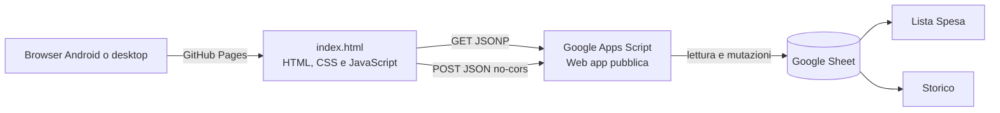

# AS-IS di Spesa PWA

Stato analizzato: 18 settembre 2026.

## Scopo attuale

Spesa PWA permette a Giulio e Alice di condividere una lista della spesa salvata in un Google Sheet. Dal telefono si può:

- scegliere chi sta usando l'app;
- aggiungere un prodotto, anche con una quantità nel formato `4 banane`;
- aumentare, diminuire o eliminare un prodotto;
- chiudere una spesa, copiando gli elementi nello storico e svuotando la lista;
- cancellare lo storico dopo una conferma.

Nel linguaggio di prodotto si può parlare di “file condiviso”, ma tecnicamente la persistenza attuale è un Google Sheet collegato a Google Apps Script, non un file Excel `.xlsx`.

## Architettura in esercizio

Il frontend è una pagina statica senza framework e senza fase di build. `index.html` contiene markup, stile e logica applicativa. L'URL del deployment Apps Script è incorporato nel frontend.

Il backend è una web app Apps Script eseguita come proprietario dello script e accessibile anche ad utenti anonimi. Usa lo spreadsheet attivo come archivio autorevole.

## Flusso dei dati

### Lettura

Il frontend richiede `GET ?action=lista` con JSONP. Apps Script restituisce ogni riga con un prodotto non vuoto: la presenza nel foglio `Lista Spesa` implica che il prodotto sia da comprare. Al caricamento iniziale il client prova fino a tre volte, con 700 ms fra i tentativi; ogni singola richiesta scade dopo 5 secondi.

JSONP è usato per attraversare i limiti CORS della web app Apps Script. Il nome della callback è generato dal client e validato dal server prima di essere inserito nella risposta JavaScript.

### Scrittura e riconciliazione

Le mutazioni sono `POST` con un corpo JSON inviato come `text/plain` e `mode: no-cors`. La risposta è quindi opaca: la risoluzione di `fetch` conferma l'invio HTTP, non il successo applicativo.

Per rendere l'interfaccia reattiva, il client:

1. disabilita i comandi;
2. applica subito la modifica alla copia locale;
3. invia il POST con timeout di 5 secondi;
4. riabilita i comandi;
5. rilegge la lista fino a cinque volte per allinearsi al foglio.

La rilettura usa un token per impedire a una riconciliazione precedente di applicarsi dopo una riconciliazione più recente. Il token viene invalidato appena inizia ogni nuova mutazione e cambia di nuovo quando parte la relativa riconciliazione. Una risposta appartenente a una generazione precedente viene ignorata e non può sostituire lo stato ottimistico più recente.

Tutte le mutazioni del foglio sono serializzate dal backend con `LockService.getScriptLock()` e un'attesa massima di 10 secondi.

## Contratto API

### GET

| Azione | Parametri | Risposta applicativa | Effetto |
|---|---|---|---|
| nessuna | nessuno | `{ ok: true, service: "Spesa API" }` | health check |
| `lista` | `callback` opzionale | `{ ok: true, lista: [{ prodotto, quantita }] }` | legge la lista corrente |

Con `callback` la risposta è JavaScript JSONP; senza callback è JSON.

### POST

| Azione | Campi | Comportamento |
|---|---|---|
| `aggiungi` | `testo`, `utente` | interpreta quantità e prodotto, rifiuta duplicati normalizzati, aggiunge una riga |
| `aumenta` | `prodotto` | incrementa di uno |
| `diminuisci` | `prodotto` | decrementa di uno; a quantità 1 elimina la riga |
| `rimuovi` | `prodotto` | elimina la riga |
| `chiudi` | nessuno | copia gli elementi da comprare nello storico e svuota il contenuto della lista |
| `pulisciStorico` | nessuno | cancella tutte le righe dati dello storico |

Le azioni sconosciute rispondono con `ok: false`. Il client non può leggere tale risposta per i POST `no-cors` e si affida alla riconciliazione successiva.

Non esiste ancora un endpoint per leggere lo storico. Questo è il principale prerequisito backend per il futuro agente di suggerimento.

## Modello del foglio

Il codice identifica i campi per posizione, quindi ordine e intestazioni non devono essere modificati senza una migrazione coordinata.

### `Lista Spesa`

| Colonna | Contenuto | Note |
|---|---|---|
| A | prodotto | nome mostrato all'utente e chiave logica normalizzata |
| B | quantità | numero; in lettura valori vuoti o non numerici diventano 1 |
| C | data inserimento | stringa `dd/MM/yyyy`, fuso `Europe/Rome` |
| D | autore | nome selezionato localmente nel browser |

### `Storico`

| Colonna | Contenuto | Note |
|---|---|---|
| A | prodotto | copiato dalla lista |
| B | quantità | quantità al momento della chiusura |
| C | data spesa | data di chiusura in formato `dd/MM/yyyy` |

La prima riga di entrambi i fogli è trattata come intestazione e viene preservata. Il codice non crea i fogli né le intestazioni.

Quando si chiude una spesa, il backend archivia nello storico tutte le righe con un prodotto non vuoto e poi cancella il contenuto delle quattro colonne dati di `Lista Spesa`. Non sono previsti prodotti non trovati o chiusure parziali.

## Identità e normalizzazione

La scelta fra Giulio e Alice è salvata in `localStorage` con la chiave `utenteSpesa`. Serve ad attribuire un inserimento, ma non autentica la persona e può essere cambiata in qualunque momento.

Client e server interpretano `4 banane` come quantità `4` e prodotto `Banane`. Se il testo non comincia con un intero positivo seguito da almeno uno spazio, la quantità è 1 e tutto il testo è il prodotto. Non sono gestite quantità decimali, unità di misura o frasi naturali più articolate.

I prodotti sono confrontati tramite nome:

- rimozione degli spazi esterni;
- conversione in minuscolo;
- rimozione dei segni diacritici Unicode.

Gli spazi interni vengono compattati durante il parsing dei nuovi prodotti. La normalizzazione usata per il confronto non compatta invece gli spazi interni; questa differenza va tenuta presente se in futuro entreranno dati direttamente dal foglio o da altri client.

## Interfaccia disponibile

L'interfaccia è pensata per schermi stretti, con larghezza massima di 500 px e pulsanti touch. Il rendering dei nomi usa `textContent`, evitando che il testo di un prodotto venga interpretato come HTML.

Sono presenti le conferme richieste prima di:

- chiudere la spesa;
- cancellare lo storico.

Il client impedisce operazioni sovrapposte mentre attende il completamento del POST. Non effettua aggiornamenti periodici e non riceve notifiche: le modifiche dell'altra persona diventano visibili al caricamento della pagina o dopo una propria mutazione e relativa riconciliazione.

## Stato PWA e installazione Android

Sono già presenti alcuni elementi PWA:

- collegamento a `manifest.json`;
- `display: standalone`, nome, colori, `start_url` e `scope`;
- icone locali con carrello 192×192 e 512×512, sia ordinarie sia `maskable`;
- registrazione di `sw.js`;
- hosting HTTPS previsto tramite GitHub Pages.

Il frontend contiene un pulsante `Installa app`, nascosto finché il browser non emette `beforeinstallprompt`. Il comando usa il prompt nativo, comunica accettazione o annullamento e resta nascosto quando l'app è già in modalità standalone.

Il service worker intercetta le richieste ma usa sempre la rete e non mantiene una cache. L'app non funziona offline, coerentemente con la dipendenza dal foglio remoto.

La nuova versione è pubblicata: pagina, manifest, service worker e quattro icone rispondono correttamente; Chromium non segnala errori manifest e registra un service worker attivo nello scope `/spesa_pwa/`. L'installazione Android non è ancora considerata verificata perché manca una prova su dispositivo reale. Nome, icone e comportamento del pulsante sono coperti da test automatici.

## Deploy

Il frontend è destinato a GitHub Pages. Nel repository non è presente un workflow dedicato alla pubblicazione Pages; la configurazione effettiva della sorgente Pages vive quindi nelle impostazioni GitHub e non è descritta dal codice.

Il backend viene aggiornato dal workflow `deploy-apps-script.yml` quando cambia `apps-script/**`, la configurazione `clasp`, lo script di deploy o il workflow stesso. Lo script:

1. ricostruisce `~/.clasprc.json` dal secret CI;
2. esegue `clasp push --force`;
3. aggiorna il deployment esistente, mantenendo stabile il suo URL.

Le credenziali non sono nel repository. Identificativi del progetto e del deployment Apps Script sono invece configurazione pubblica e compaiono nel codice.

## Test presenti

| Livello | File/workflow | Copertura effettiva |
|---|---|---|
| sintassi | esecuzione locale con Node | JavaScript del frontend, service worker, test, server e backend Apps Script |
| browser simulato | `tests/frontend.spec.js` | retry della prima lettura; protezione da riconciliazioni obsolete; decremento, incremento ed eliminazione; controlli nuovamente usabili |
| browser con foglio reale | `tests/sheet.spec.js` | aggiunta, incremento, decremento, eliminazione e riconciliazione; prodotto univoco e pulizia mirata |
| smoke pubblicato | `.github/workflows/smoke.yml` | raggiungibilità frontend, GET JSONP e POST innocuo verso Apps Script |
| CI frontend | `.github/workflows/frontend-e2e.yml` | checkout locale con backend simulato; test reale solo su avvio manuale esplicito |

Il progetto Playwright blocca il service worker nei test simulati. Il test con foglio reale usa invece il service worker e il deployment backend estratto da `index.html`; non esercita modifiche backend locali finché queste non sono pubblicate.

Verifiche svolte sullo stato corrente:

- test backend Apps Script isolati: 6 superati, inclusi schema a quattro colonne, chiusura completa e migrazione;
- controllo sintattico JavaScript: superato;
- test Playwright simulati: 3 superati con Chromium, incluso il caso di regressione `REQ-SYNC-001`;
- test CRUD con Google Sheet reale: 1 superato, con prodotto univoco e pulizia verificata;
- migrazione del foglio reale: completata, colonna `Stato` rimossa;
- backend pubblicato: deployment versione 17 verificato in lettura;
- chiusura completa sul foglio reale: non eseguita per non archiviare eventuali prodotti reali; coperta dal test backend isolato;
- struttura installabile del sito pubblicato: verificata con manifest senza errori e service worker attivo;
- esperienza sul launcher Android: non ancora verificata su dispositivo reale.

## Limiti e rischi noti

1. **Accesso pubblico alle mutazioni, rischio accettato.** La web app Apps Script accetta utenti anonimi e non verifica un segreto o un'identità. Chi conosce l'endpoint può modificare la lista, chiuderla o cancellare lo storico. Questa modalità è stata confermata in `ADR-001` per la fase attuale.
2. **Cancellazione completa esposta.** `pulisciStorico` è una rotta pubblica distruttiva; la conferma esiste solo nell'interfaccia e può essere aggirata chiamando direttamente l'API.
3. **Nessun aggiornamento tra dispositivi in tempo reale.** Un browser aperto non vede autonomamente i cambiamenti dell'altro.
4. **Esito POST non osservabile.** Errori applicativi sono scoperti soltanto dalla rilettura; un timeout non dimostra che la scrittura non sia avvenuta.
5. **Storico troppo povero per analisi evolute.** Registra prodotto, quantità e giorno, ma non conserva autore, identificativo della sessione di spesa, orario o categorie.
6. **Codice frontend monolitico.** Tutta l'app è in un solo HTML; è ancora gestibile, ma voce, installazione guidata e suggerimenti renderanno utile separare almeno logica, stile e UI.
7. **Copertura incompleta.** I test frontend simulati non coprono aggiunta, duplicati, chiusura, pulizia, errori POST, selezione utente, parsing o installabilità; parte della logica backend corrispondente è coperta separatamente.

## Confini da preservare

- Il Google Sheet resta la fonte autorevole; lo stato ottimistico deve sempre essere riconciliato.
- I prodotti continuano a essere identificati dal nome normalizzato e non dall'indice di riga nel frontend.
- Parsing e normalizzazione devono rimanere coerenti fra client e server.
- Le intestazioni e l'ordine delle colonne devono essere preservati, salvo migrazione esplicita.
- Le mutazioni backend devono restare protette da lock.
- Le conferme per chiusura della spesa e cancellazione dello storico devono rimanere.
- Le funzioni AI future devono proporre modifiche, lasciando all'utente la conferma prima di cambiare la lista.
