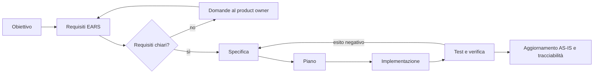

# Processo di sviluppo

## Obiettivo

Il progetto procede per incrementi piccoli e verificabili. Ogni incremento attraversa requisiti, specifica, piano, sviluppo e verifica prima di essere considerato concluso.

Il diagramma descrive un ciclo iterativo, non fasi definitive per l'intero prodotto. Una nuova evidenza può riportare un incremento alla specifica o ai requisiti.

## Stati dei documenti

Ogni requisito, specifica e piano dichiara uno stato:

- `Bozza`: documento incompleto o contenente domande aperte;
- `Da approvare`: completo, in attesa di una decisione del product owner;
- `Approvato`: base autorizzata per la fase successiva;
- `Implementato`: comportamento presente nel codice;
- `Verificato`: implementazione controllata rispetto ai criteri di accettazione;
- `Superato`: sostituito da un documento successivo, che deve essere indicato.

Un documento con domande funzionali aperte non passa allo stato `Approvato`. Correzioni tecniche che applicano vincoli già espliciti possono essere approvate nel normale lavoro di manutenzione, purché non introducano una nuova scelta di prodotto.

## Requisiti EARS

Ogni requisito ha un identificativo stabile nel formato `REQ-<AREA>-<numero>`. Le forme preferite sono:

- generale: “Il sistema deve…”;
- guidata da evento: “Quando `<evento>`, il sistema deve…”;
- guidata da stato: “Mentre `<stato>`, il sistema deve…”;
- comportamento indesiderato: “Se `<condizione anomala>`, il sistema deve…”;
- funzione opzionale: “Dove `<funzione disponibile>`, il sistema deve…”.

Un requisito descrive un comportamento osservabile o un vincolo verificabile. Non prescrive la soluzione tecnica, salvo che la tecnologia sia essa stessa un vincolo del progetto.

Ogni file di requisiti contiene:

- contesto e obiettivo;
- requisiti EARS;
- criteri di accettazione;
- esclusioni esplicite;
- dipendenze;
- domande aperte;
- collegamenti a specifica, piano e test.

## Specifica e piano

La specifica usa il codice `SPEC-<AREA>-<numero>` e spiega come soddisfare uno o più requisiti: componenti coinvolti, flussi, interfacce, dati, casi di errore e strategia di test.

Il piano usa il codice `PLAN-<AREA>-<numero>` e traduce la specifica in passi ordinati. Deve indicare file interessati, verifiche previste, rischi e criterio di completamento. Il piano non sostituisce la specifica e non aggiunge requisiti.

## Tracciabilità

Ogni specifica cita i requisiti coperti. Ogni piano cita la specifica. I test significativi riportano gli ID dei requisiti nel titolo o in un commento vicino al caso verificato. Al termine si aggiorna la matrice di tracciabilità nel file dei requisiti interessato.

Una modifica è completa quando:

1. i requisiti non hanno domande bloccanti;
2. specifica e piano riflettono l'implementazione finale;
3. i criteri di accettazione sono verificati o le verifiche mancanti sono dichiarate;
4. contratti API e struttura del foglio sono preservati o migrati esplicitamente;
5. l'AS-IS descrive il nuovo stato;
6. rischi e decisioni durature sono registrati.

## Uso dell'agente AI

L'agente può autonomamente analizzare il codice, proporre alternative tecniche, mantenere i documenti, implementare requisiti approvati ed eseguire verifiche non distruttive.

L'agente deve chiedere al product owner quando una scelta modifica il comportamento percepito, i dati conservati, il modello di accesso, le conferme richieste, la priorità fra funzionalità o un criterio di accettazione non ancora definito. Le risposte diventano requisiti o decisioni nel repository.

Le assunzioni temporanee devono essere dichiarate e non possono trasformarsi implicitamente in requisiti. Il product owner ha autorizzato l'uso del Google Sheet condiviso durante lo sviluppo. I test devono comunque usare prodotti identificabili e pulizia mirata quando verificano operazioni CRUD; chiusura della spesa e cancellazione dello storico richiedono una prova pianificata perché coinvolgono dati condivisi. Nessun esito POST opaco viene considerato prova sufficiente del salvataggio.

## Decisioni architetturali

Una ADR è necessaria quando una scelta:

- modifica un contratto fra frontend, API e foglio;
- introduce o rimuove una dipendenza;
- cambia autenticazione, autorizzazione o trattamento dei dati;
- comporta una migrazione;
- ha alternative realistiche e conseguenze durature.

Correzioni locali e reversibili possono essere spiegate direttamente nella specifica.
