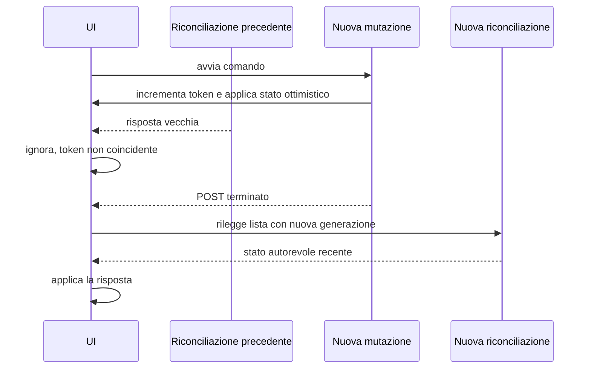

# SPEC-SYNC-001 — Invalidazione delle letture obsolete

Stato: Verificato

Requisito coperto: [`REQ-SYNC-001`](../requirements/REQ-SYNC-001.md).

## Soluzione

`reconcileToken` rappresenta la generazione dello stato client. Ogni riconciliazione conserva la generazione valida al proprio avvio e applica il risultato soltanto se essa coincide ancora con quella globale.

All'inizio di ogni operazione di scrittura, prima di modificare lo stato locale, il client incrementa `reconcileToken`. Questo invalida immediatamente tutte le letture partite in precedenza. `riconciliaInBackground()` continua a incrementare il contatore quando crea una nuova riconciliazione e a controllarlo prima di applicare una risposta o mostrare il messaggio di mancata verifica.

L'invalidazione viene centralizzata nel passaggio allo stato occupato, già comune a tutte le mutazioni. L'incremento avviene soltanto quando si entra nello stato occupato; il ritorno allo stato libero non modifica il token.

## Componenti interessati

- `index.html`: funzione `setBusy` e contatore `reconcileToken`;
- `tests/frontend.spec.js`: test browser con risposte controllate e backend simulato.

Il backend, il service worker e il modello del foglio non cambiano.

## Sequenza attesa

## Strategia di verifica

Il test browser simula questa intercalazione:

1. prima mutazione completata e relativa riconciliazione mantenuta pendente;
2. seconda mutazione avviata e stato ottimistico applicato;
3. risposta della prima riconciliazione rilasciata con dati vecchi;
4. verifica che i dati vecchi non compaiano nella UI;
5. completamento della seconda mutazione e risposta della nuova riconciliazione;
6. verifica dello stato finale e dei comandi abilitati.

Non servono scritture sul Google Sheet reale.
